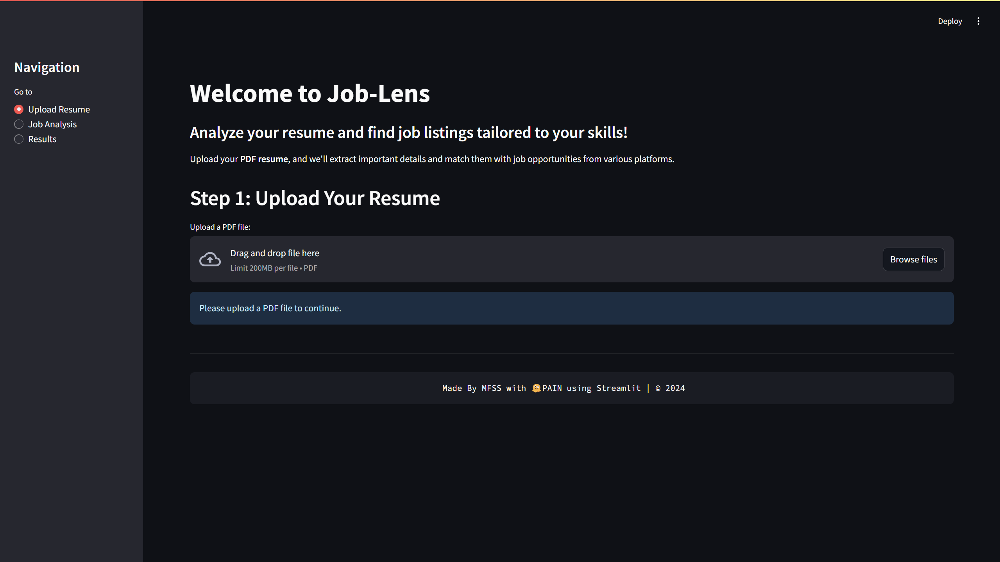
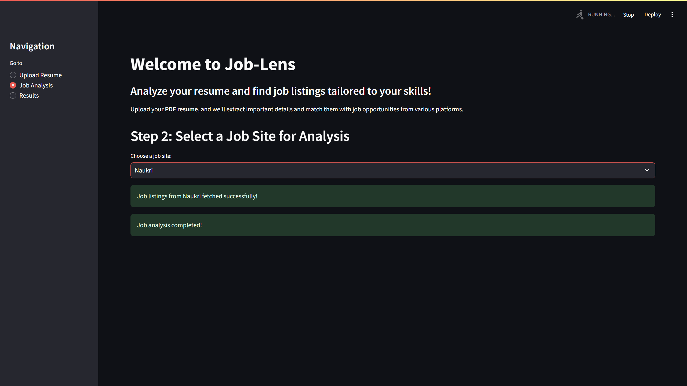

# AI-Powered Job Relevance Analyzer  

## Presentation Overview  

### **Title & Problem Statement**  
**Job-Lens**: A tool that analyzes user resumes to find job listings tailored to their skills using the GenAI model **LLama 3 - 70B**.  

The project focuses on building an **AI-powered Job Relevance Analyzer** to bridge the gap between user qualifications and job opportunities by:  
1. Extracting user skills, projects, internships, and interests from resumes.  
2. Categorizing job listings into actionable categories like **Must Apply**, **Good Fit**, **Neutral**, and **Ignore**.  
3. Providing personalized recommendations to help users target the most relevant career opportunities.  

---

### **Proposed Solution**  
- **Resume Analysis**: The system uses **LLama 3 - 70B** to extract skills, projects, and interests from uploaded resumes.  
- **Job Listings Integration**:  
  - **Jooble**: API-based integration.  
  - **Indeed, Naukri, Foundit**: Web scraping using Selenium.  
- **Categorization**: Jobs are grouped into four categories: **Must Apply**, **Good Fit**, **Neutral**, and **Ignore**, with actionable insights like strengths, improvement areas, and reasons for categorization.  

---

### **Technology Stack**
1. **Frontend**: Built with Streamlit for user interactivity.  
2. **Backend**: Hugging Face-hosted LLama 3 - 70B model for advanced NLP capabilities.  
3. **Web Scraping**: Selenium for real-time job scraping.  
4. **API Integration**: Jooble API for LinkedIn job listings.  
5. **Hosting**: Deployed in the cloud via Hugging Face.

---

### **Implementation Highlights**  
- **Data Processing**: Resumes analyzed to extract key domains like skills and interests.  
- **Flexibility**: Users can select one of four job platforms for tailored analysis.  
- **Fault Tolerance**: Combination of API and web scraping ensures robust functionality.  
- **Real-Time Analysis**: System processes resumes and job listings in real-time, delivering results in under two minutes.  
- **Actionable Feedback**: Users receive strengths, areas of improvement, and targeted job opportunities.  

---

### **Challenges Faced**  
1. **LinkedIn Scraping**: As direct LinkedIn scraping is illegal, Jooble (an aggregator of LinkedIn jobs) was used as a workaround.  
2. **Web Scraping**: Frequent framework changes posed challenges; Selenium-based scraping ensured dynamic handling.  
3. **Driver Compatibility**: Mismatch between Windows-based web drivers (local) and Linux drivers (Hugging Face cloud) caused deployment issues.  
4. **Seamless Integration**: Integrating independently developed components coherently was a significant challenge.  

---

## File Overview  

### **app.py**  
- **Purpose**: Main application file containing the Streamlit interface.  
- **Functionality**:  
  - Facilitates user interactions, such as uploading resumes.  
  - Connects to the backend for job analysis and categorization.  
  - Displays job results with actionable insights.  

### **all_scrappers.py**  
- **Purpose**: Handles web scraping for job platforms (Indeed, Foundit, Naukri).  
- **Details**:  
  - Uses Selenium to scrape real-time job listings.  
  - Implements robust error handling to manage website framework changes.  

### **pdf_reader.py**  
- **Purpose**: Processes uploaded resumes in PDF format.  
- **Functionality**:  
  - Extracts text from resumes.  
  - Sends extracted data to the LLama 3 - 70B model for domain analysis.  

---

## Demo Workflow  
1. **Upload Resume**: Users upload their resume via the Streamlit interface.  
2. **Domain Extraction**: LLama 3 - 70B model identifies key domains from the resume.  
3. **Job Selection**: Users choose one of the four job platforms for analysis.  
4. **Job Categorization**: Jobs are categorized into actionable groups with reasons and feedback.  
5. **Results Display**: The system highlights suitable job opportunities and user strengths.  

---

### Note:  
- The system takes approximately 2 minutes to scrape data and process results.  
- In case of driver compatibility issues on Hugging Face, a localhost demo video has been provided.  

---

## Example workflow pics

### Step 1

### Step 2

### Step 3

### Step 4

---

## Project Demo of Jooble api hosted on cloud (Hugging Face)

[Click here to watch the video](https://drive.google.com/file/d/1ZCHLh8mgSVtu7gixvjWLL8dQbCD_NulN/view?usp=sharing)

## Project Demo of Automated Web Scrapping (Naukri/Indeed/Foundit)

[Click here to watch the video](https://drive.google.com/file/d/1g0l4dPZ1qKa4f2WQUxxP9AQuz5UjOM0T/view?usp=sharing)
